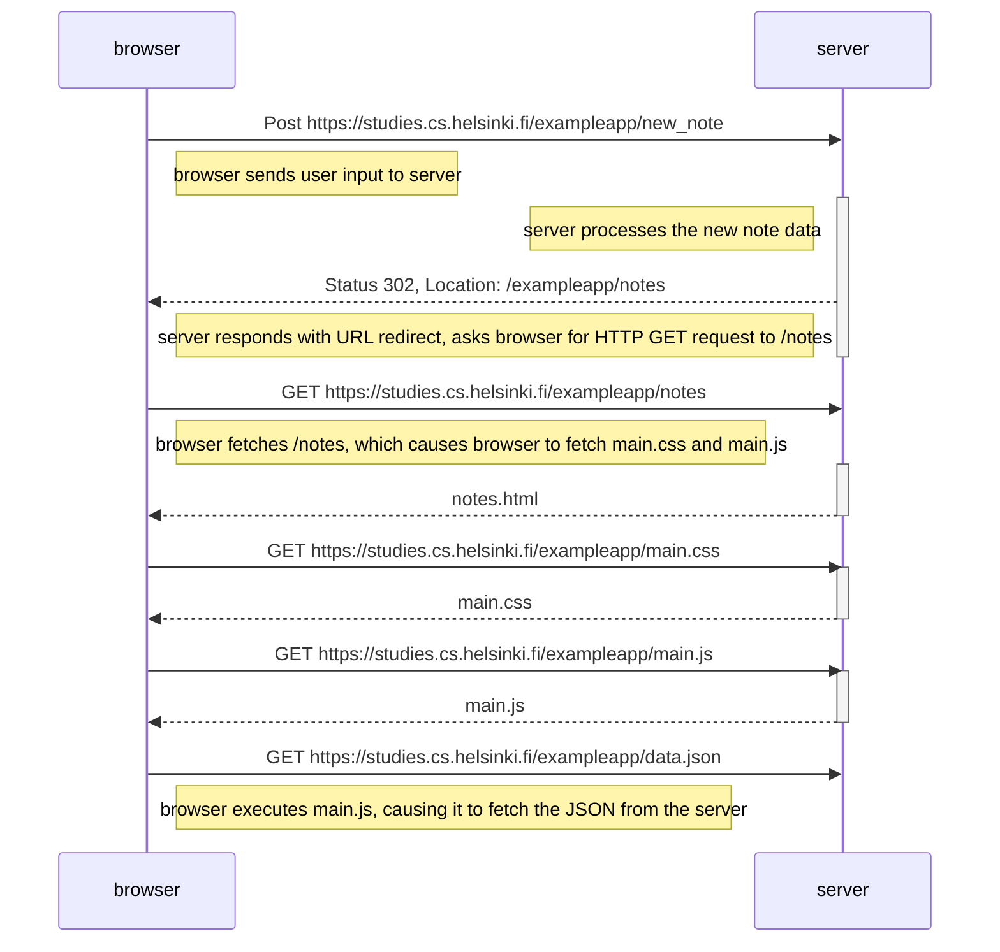

```mermaid
    sequenceDiagram
        participant browser
        participant server

browser->>server: Post https://studies.cs.helsinki.fi/exampleapp/new_note
        Note right of browser: browser sends user input to server
        activate server
        Note left of server: server processes the new note data
        server-->>browser: Status 302, Location: /exampleapp/notes
        Note left of server: server responds with URL redirect, asks browser for HTTP GET request to /notes
        deactivate server
        
        browser->>server: GET https://studies.cs.helsinki.fi/exampleapp/notes
        Note right of browser: browser fetches /notes, which causes browser to fetch main.css and main.js
        activate server
        server-->>browser: notes.html
        deactivate server
            
        browser->>server: GET https://studies.cs.helsinki.fi/exampleapp/main.css
        activate server
        server-->>browser: main.css
        deactivate server
        
        browser->>server: GET https://studies.cs.helsinki.fi/exampleapp/main.js
        activate server
        server-->>browser: main.js
        deactivate server

        browser->>server: GET https://studies.cs.helsinki.fi/exampleapp/data.json
        Note right of browser: browser executes main.js, causing it to fetch the JSON from the server
```
