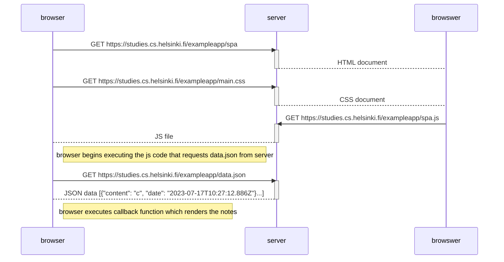

```mermaid
    sequenceDiagram
        participant browser
        participant server

        browser->>server: GET https://studies.cs.helsinki.fi/exampleapp/spa
        activate server
        server-->browswer: HTML document
        deactivate server

        browser->>server: GET https://studies.cs.helsinki.fi/exampleapp/main.css
        activate server
        server-->browswer: CSS document
        deactivate server

        browswer->>server: GET https://studies.cs.helsinki.fi/exampleapp/spa.js
        activate server
        server-->browser: JS file
        deactivate server

        Note right of browser: browser begins executing the js code that requests data.json from server

        browser->>server: GET https://studies.cs.helsinki.fi/exampleapp/data.json
        activate server
        server-->browser: JSON data [{"content": "c", "date": "2023-07-17T10:27:12.886Z"}...]
        deactivate server
        Note right of browser: browser executes callback function which renders the notes
```