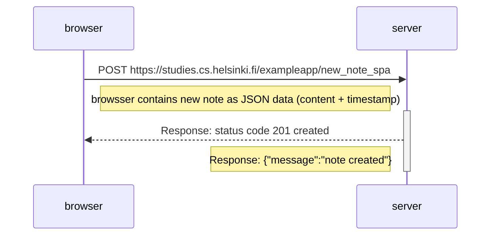

```mermaid
    sequenceDiagram
        participant browser
        participant server

        browser->>server: POST https://studies.cs.helsinki.fi/exampleapp/new_note_spa
        Note right of browser: browsser contains new note as JSON data (content + timestamp)
        activate server
        server-->>browser: Response: status code 201 created
        Note left of server: Response: {"message":"note created"}
        deactivate server        
```